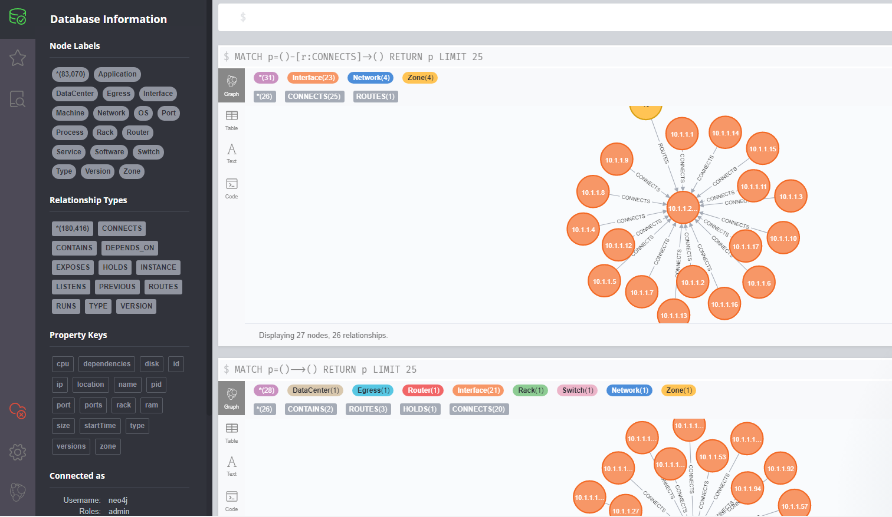

# linkeddata-tutorial

# Tutorial 1: JSON-LD

## rough ideas

* make UML of a data model in draw.io?
* export to xml and open as graph in python with [rdflib](https://github.com/RDFLib/rdflib)?
  * https://stackoverflow.com/questions/49512713/parsing-rdf-xml-file-with-dom-on-python-3-6
* database to store sample data: [Neo4j](https://neo4j.com/download-neo4j-now/?utm_program=emea-prospecting&utm_source=google&utm_medium=cpc&utm_campaign=emea-search-branded&utm_adgroup=neo4j-general&gclid=Cj0KCQiA3smABhCjARIsAKtrg6K8B5rZ9drYPCgPGy8bDjc3y3JoutlYL_KRfxeIFfnJq2AJ66ru8-AaAqrmEALw_wcB)?
* OSLO works with [JSON-LD](https://json-ld.org/primer/latest/)
  * see [example here](https://data.vlaanderen.be/context/waterdeel.jsonld)
* JSON-LD to Neo4J using: 
  * https://neo4j.com/labs/neosemantics/4.0/ ?
  * https://towardsdatascience.com/traveling-tourist-part-1-import-wikidata-to-neo4j-with-neosemantics-library-f80235f40dc5
* hosting Neo4J in the cloud? https://neo4j.com/developer/guide-cloud-deployment/
* might be usefull: 
  * https://github.com/neo4j-labs/rdflib-neo4j
  * https://neo4j.com/docs/labs/nsmntx/current/import/
    
## tutorial

* start from model of OSLO
* add some data fields
* convert messy excel to JSON-LD
  * provide scripts for this
* upload data to cloud neo4J database
* visualise the data in their interactive browser

  
## hands on

 * do the same but with own data

# Tutorial 2: WaterML?

# Tutorial 3: more IoT / fiware?

